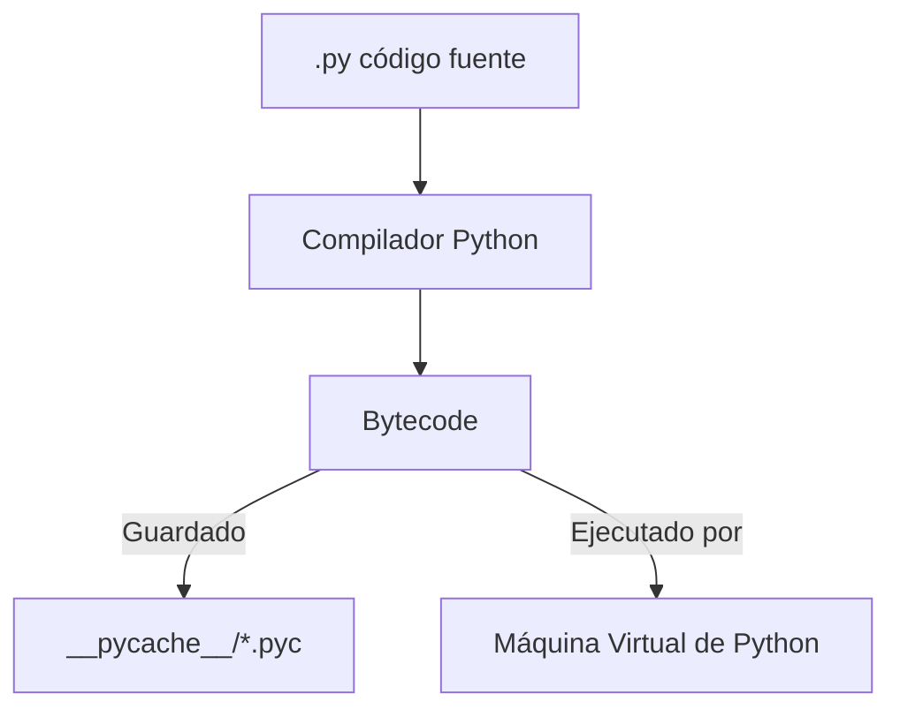
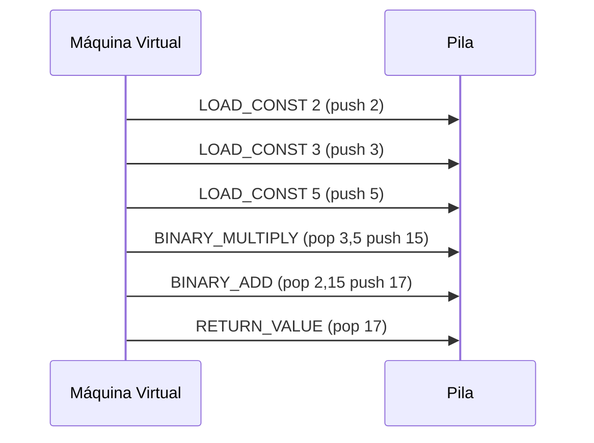
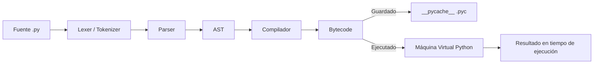

# Entendiendo `__pycache__`, `.pyc`, AST y Bytecode en Python

Este documento sirve como guía técnica para comprender en profundidad por qué Python genera automáticamente carpetas `__pycache__`, qué contienen los ficheros `.pyc`, cómo funciona el **AST (Abstract Syntax Tree)** y qué significa que Python ejecute **opcodes sobre un stack virtual**.

---

## 1. ¿Qué es `__pycache__`?
Cuando ejecutas un programa en Python:
1. El código fuente `.py` se **compila a bytecode**.
2. Ese bytecode se guarda en ficheros `.pyc` dentro de la carpeta `__pycache__`.
3. Si vuelves a ejecutar el programa, Python no recompila desde cero si el `.pyc` sigue siendo válido.

👉 Ventajas:
- Acelera ejecuciones posteriores.
- Evita recompilar siempre que el código no haya cambiado.

---

## 2. ¿Qué contienen los `.pyc`?
Un fichero `.pyc` contiene:
1. **Cabecera** (magic number, timestamp/hash de la fuente).
2. **Bytecode** serializado (instrucciones para la máquina virtual de Python).
3. **Constantes y referencias** necesarias para ejecutar el módulo.

### Flujo de ejecución simplificado:


---

## 3. AST: Abstract Syntax Tree

El **AST** es una representación estructurada del programa, sin detalles superficiales de la sintaxis.

### Ejemplo:
Código fuente:
```python
a = 2 + 3 * 5
```

AST simplificado:
```
Assign
 ├─ Name(id='a')
 └─ BinOp
     ├─ Constant(2)
     ├─ Add
     └─ BinOp
         ├─ Constant(3)
         ├─ Mult
         └─ Constant(5)
```

👉 Python genera este árbol tras el análisis sintáctico y lo usa para producir bytecode.

### Proceso con AST en Python:
```python
import ast, pprint
code = "a = 2 + 3 * 5"
tree = ast.parse(code)
pprint.pprint(ast.dump(tree, indent=4))
```

---

## 4. Bytecode y opcodes

Después de compilar el AST, Python genera **bytecode**: instrucciones secuenciales llamadas **opcodes**.

### Ejemplo:
```python
def calc():
    return 2 + 3 * 5
```

Desensamblando:
```python
import dis
dis.dis(calc)
```

Salida típica:
```
  2           0 LOAD_CONST               2 (2)
              2 LOAD_CONST               3 (3)
              4 LOAD_CONST               4 (5)
              6 BINARY_MULTIPLY
              8 BINARY_ADD
             10 RETURN_VALUE
```

👉 Cada línea es un **opcode**.

---

## 5. El *Stack Frame Virtual*

La máquina virtual de Python es **stack-based**, usa una pila de operandos para ejecutar instrucciones.

### Ejecución de `2 + 3 * 5` paso a paso:
1. `LOAD_CONST 2` → apila `2`.  
   Stack: `[2]`
2. `LOAD_CONST 3` → apila `3`.  
   Stack: `[2, 3]`
3. `LOAD_CONST 5` → apila `5`.  
   Stack: `[2, 3, 5]`
4. `BINARY_MULTIPLY` → saca `3` y `5`, calcula `15`, apila `15`.  
   Stack: `[2, 15]`
5. `BINARY_ADD` → saca `2` y `15`, calcula `17`, apila `17`.  
   Stack: `[17]`
6. `RETURN_VALUE` → devuelve `17`.  



---

## 6. Resumen

- `__pycache__` contiene bytecode cacheado (`.pyc`) para acelerar importaciones.
- `.pyc` = bytecode + cabecera de control + constantes.
- El **AST** es el árbol lógico intermedio entre el código fuente y el bytecode.
- El **bytecode** son opcodes simples que manipulan una pila.
- El **stack frame virtual** es donde se almacenan operandos y contexto de ejecución.

👉 Entender esta cadena ayuda a comprender cómo Python traduce texto en comportamiento ejecutable.

---

## 7. Cadena completa de ejecución


