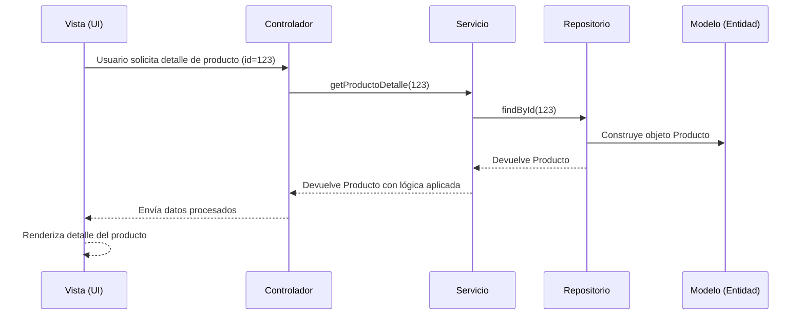
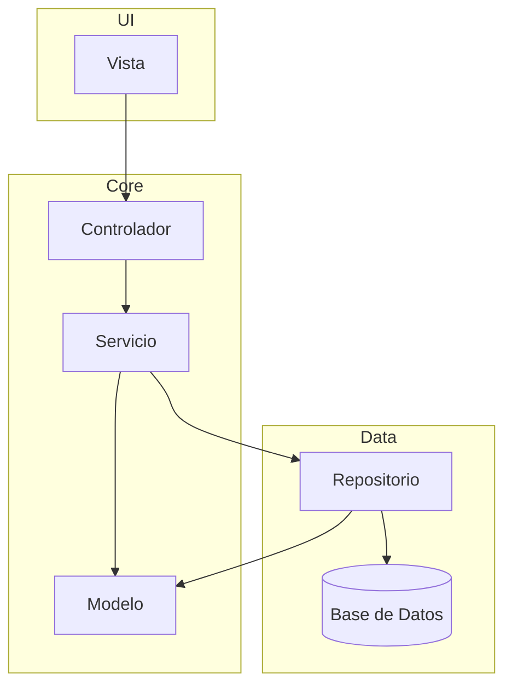

```mermaid
sequenceDiagram
    participant Vista as Vista (UI)
    participant Controlador as Controlador
    participant Servicio as Servicio
    participant Repositorio as Repositorio
    participant Modelo as Modelo (Entidad)

    Vista->>Controlador: Usuario solicita detalle de producto (id=123)
    Controlador->>Servicio: getProductoDetalle(123)
    Servicio->>Repositorio: findById(123)
    Repositorio->>Modelo: Construye objeto Producto
    Repositorio-->>Servicio: Devuelve Producto
    Servicio-->>Controlador: Devuelve Producto con lógica aplicada
    Controlador-->>Vista: Envía datos procesados
    Vista-->>Vista: Renderiza detalle del producto
```

---

```mermaid
graph TD
    subgraph UI
        Vista[Vista]
    end

    subgraph Core
        Controlador[Controlador]
        Servicio[Servicio]
        Modelo[Modelo]
    end

    subgraph Data
        Repositorio[Repositorio]
        BD[(Base de Datos)]
    end

    Vista --> Controlador
    Controlador --> Servicio
    Servicio --> Repositorio
    Repositorio --> BD
    Repositorio --> Modelo
    Servicio --> Modelo

```